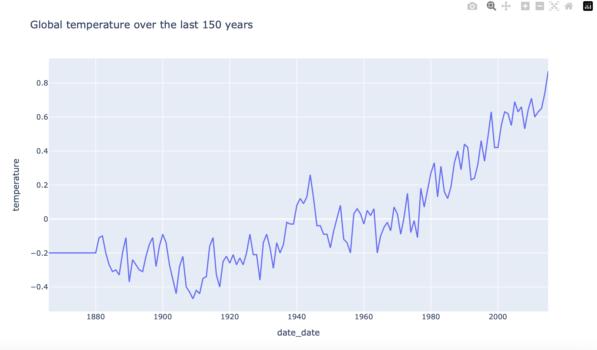
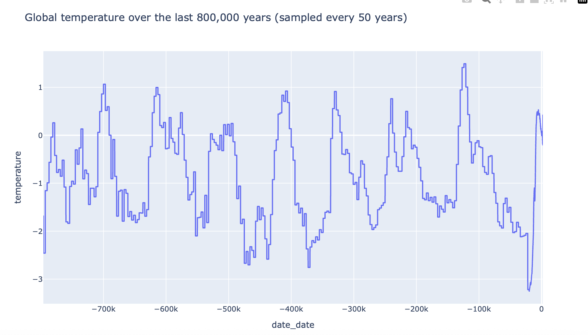

# 🌍 Earth Temperature Change Analysis (800,000 years)

This project analyzes the evolution of global temperatures and greenhouse gases over different time scales, from the last 800,000 years to the last 150 years.  
The goal is to understand long-term climate cycles and quantify the recent acceleration of global warming linked to human activity.

This mini-project also demonstrates:
- Python data analysis (pandas, plotly, scikit-learn)
- Dataset merging & cleaning
- Correlation analysis (short & long term)
- Simple linear regression for interpretability
- Clear visualizations
---

## 📁 Dataset

The data comes from scientific reconstructions based on:
- Ice-core drilling  
- Sediment analysis  
- Instrumental temperature records (post-1880)

It includes:
- Global temperature anomalies  
- CO₂ concentrations  
- Methane (CH₄) concentrations  
- Nitrous oxide (N₂O / “no₂”) concentrations  

---

## 🎯 Objectives

- Compare **natural long-term climate cycles** vs **recent rapid warming**
- Analyze correlations between temperature and greenhouse gases
- Visualize temperature evolution on:
  - the last 800,000 years  
  - the last 150 years  
- Evaluate the explanatory power of CO₂, CH₄ and N₂O via linear regression

---

## 🔧 What the Python script does

### 1. **Loads the four datasets** (temperature + 3 gases) from Excel  
### 2. **Computes a common date range** shared by all time series  
### 3. **Merges everything** into a single clean dataframe  
### 4. **Interpolates missing values**  
### 5. **Performs two analyses**:
- **Short-term (last 150 years)** → industrial era  
- **Long-term (800k years)** → glacial cycles vs anthropogenic warming  
### 6. **Creates visualizations** with Plotly  
### 7. **Runs a linear regression** to evaluate the greenhouse-gas → temperature relationship

## 📊 Key Findings

### **Short-term (150 years)**
- Temperature rises **sharply and continuously** from ~1880  
- Strong correlation between temperature and CO₂/CH₄/N₂O  
- Linear regression shows high explanatory power → warming is not random

### **Long-term (800,000 years)**
- Natural climate cycles exist (glacial / interglacial)  
- But the **current warming is much faster and stronger** than any natural cycle  
- Greenhouse gases track temperature closely over geological scales

> Renewable and nuclear energy expanded, but fossil fuel use continued to grow —  
> therefore emissions **added up**, instead of being replaced.

---

